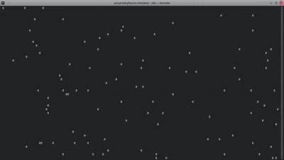

# The Unnamed Particle Simulator
A program that simulates the random motion of particles, just like gas molecules
in a container.
Runs entirely in the commandline.

---
# Limitations
- Currently only works on Linux, Mac and other POSIX compliant operating systems. Thus Windows is not supported.
- Doesn't have collision among particles yet.
- Doesn't have a dedicated 'quit' command yet. You have to manually kill the terminal session to exit.
- Due to the limitations of rendering objects in a terminal, the velocities of particles are prefixed integral values.

---
# Demo



---
# Features
- Runs enitrely in the commandline without any need of a graphics client.
- Runs at 60 fps.
- Number of particles to simulate can be passed as an argument.

---
# Installation
- Clone the repo.
- Then compile it using `make`

```bash
git clone https://github.com/raghav-4002/unnamed-particle-simulator.git ~/unnamed-particle-simulator
cd ~/unnamed-particle-simulator
make
```

- If GNU make is not available in your system, then run the following:

```bash
git clone https://github.com/raghav-4002/unnamed-particle-simulator.git ~/unnamed-particle-simulator
cd ~/unnamed-particle-simulator
gcc -o main.c physics.c setup.c draw.c main
```

---
# Usage
```bash
./main <no-of-particles-to-simulate>
```

- To quit, you have to kill your terminal session.

---
# Technologies used
- Language(s): C
- Tool(s): Makefile, GCC